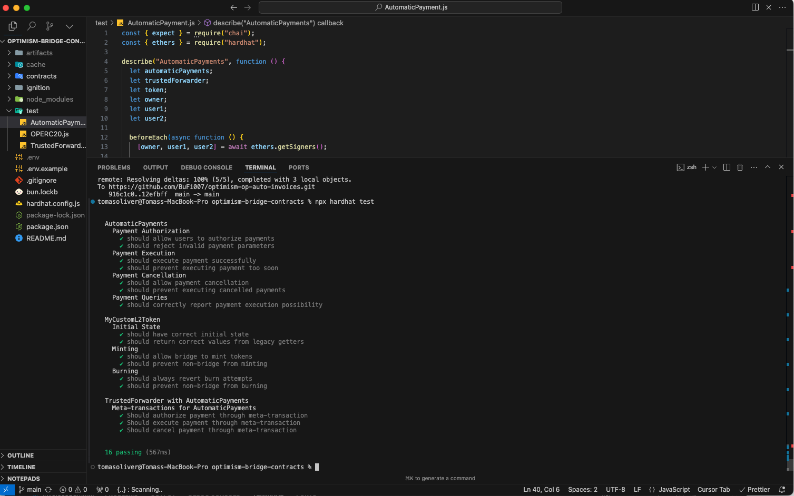

# 🌟 Optimism Hackathon Project: ZK-Powered Automatic Payments 🚀

## Overview

This project combines several cutting-edge blockchain technologies to create a secure and efficient payment system on Optimism:

- ✨ Zero-Knowledge Proofs for Privacy
- 🔄 Meta Transactions for Gas-less Operations
- 💎 Custom OP-ERC20 Token Implementation

## 🏗️ Architecture

### ZK Proof Implementation

Our system uses Zero-Knowledge proofs to verify payment conditions without revealing sensitive user data. The ZK circuit validates:

- Payment thresholds
- User eligibility
- Time-based conditions

### 🎭 Meta Transactions

We implement meta transactions using the TrustedForwarder pattern, allowing users to:

- Execute transactions without holding ETH
- Delegate gas fees to relayers
- Maintain transaction security through signature verification

### 💫 Custom OP-ERC20 Token (MCL2T)

Our token is specifically designed for the Optimism L2, featuring:

- Seamless bridge integration with L1
- Optimized for low gas costs
- Built-in meta transaction support

## 📍 Deployed Contracts (Optimism Sepolia)

| Contract          | Address                                      |
| ----------------- | -------------------------------------------- |
| MyCustomL2Token   | `0x4BdE0740740b8dBb5f6Eb8c9ccB4Fc01171e953C` |
| TrustedForwarder  | `0x6e1180674368878f6b67E1DCB6E4DFd0C102703A` |
| AutomaticPayments | `0x6e5f00C0b246E8c7C2aF4A74cd2b8bd33Fb5Ab94` |

## 🚀 Features

- ⚡ Gas-optimized operations
- 🔐 Privacy-preserving payments
- 🌉 L1 <> L2 bridge integration
- 📱 User-friendly meta transactions
- 🔄 Automatic payment scheduling

## 🛠️ Technical Stack

- Optimism Network
- Hardhat & Ignition deployment framework
- Solidity v0.8.28
- ZK-SNARK circuits
- Meta transaction infrastructure

## 🔗 Getting Started

1. Clone the repository
2. Copy `.env.example` to `.env` and fill in your private key
3. Install dependencies: `npm install`
4. Deploy contracts: `npx hardhat run scripts/deploy.js --network op-sepolia`

## 🤝 Contributing

Contributions are welcome! Please feel free to submit a Pull Request.

## 📄 License

This project is licensed under the MIT License.

## IMAGES

## 📚 References

- [Optimism Sepolia](https://sepolia.optimism.io/)
- [OP-ERC20](https://docs.optimism.io/developers/l2/technical-reference/op-erc20/)
- [OP-ERC20 Implementation](https://github.com/ethereum-optimism/optimism/blob/develop/packages/contracts-bedrock/contracts/standards/erc20/OPERC20.sol)
